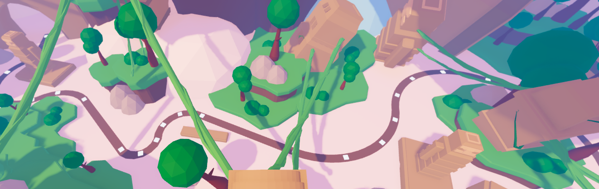
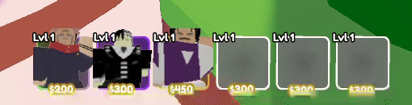
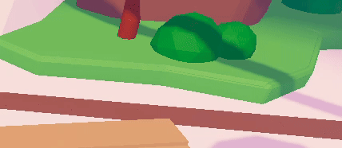

# Roblox Tower Defence Aniverse Framework

**Date:** June 2025

---

## 🚀 Project Overview

This repository presents the core framework for a comprehensive tower defence framework built on the Roblox platform. It's designed with modularity and extensibility in mind, showcasing robust scripting for various game systems, UI management, and character animation handling. This project serves as a demonstration of clean code practices, efficient system design, and practical application of Luau within Roblox Studio.

---

## ✨ Key Features & Systems

* **Optimized Networking with Bitpacking:** Implements efficient network communication using bitpacking techniques to reduce data transfer size and latency for critical game state updates.
* **Performance-Driven Rendering (Frustum Culling):** Utilizes frustum culling to optimize rendering performance by only drawing objects visible within the camera's view, significantly improving frame rates in complex scenes.
* **Advanced Grid Search / Pathfinding:** Leverages efficient grid search algorithms for in-game logic, such as enemy pathfinding or tower placement validation.
* **Modular UI System:** Manages complex user interfaces, including dynamic slot management for inventory or abilities.
* **Robust Combat & Damage System:** A comprehensive system for applying and managing damage, supporting various combat scenarios and entity interactions.
* **Intelligent Enemy Management:** Efficiently handles enemy spawning, lifecycle, and core AI behaviors.
* **Player Data Handling:** Core module for managing and persistently storing player-specific game data.
* **Strategic Tower Placement Logic:** Server-side logic for handling player tower placement, including validation and interaction, integrated into a Tower Defense context.
* **Dynamic Character Animation:** Client-side scripts to manage character animations for various entities, providing fluid movement.
* **Centralized Module Management:** Organized structure within `ReplicatedStorage` and `ServerStorage` for reusable code and clear separation of concerns.

---

## 🎮 Demo & Screenshots

* **Smooth Curved Path Generation:**
    A screenshot demonstrating the aesthetically pleasing and precisely generated curved paths for entities, using Catmull-Rom splines. The white blocks indicate the spline control points used for defining these smooth trajectories.

    

* **Dynamic UI System:**
    Showcasing animated character models within the UI and an automated color scheme selection based on item rarity.

    

* **Intuitive Unit Placement:**
    A GIF demonstrating the responsive unit placement system, including real-time red/green highlights for invalid/valid positions and clear attack range indicators.

    

* **Massive Unit Performance & Network Optimization:**
    A demonstration of over 100+ animated units running smoothly at ~90 FPS, highlighting the effectiveness of the network optimization and rendering techniques.

    

    **Network Statistics:**
    * **Incoming (Overall):** ~12.58 KB/s, 33.84 Pkt/s (Very low for large unit counts, indicating efficient data handling)
    * **In Data (KB/s, Pkt/s):** ~10.75 KB/s, 19.55 Pkt/s (Minimal general replication data)
    * **In Physics (KB/s, Pkt/s):** ~1.69 KB/s, 13.70 Pkt/s (Low physics overhead)
    * **Outgoing (Overall):** ~0.48 KB/s (Excellent, minimal data sent from client)

    These statistics underscore the impact of advanced techniques like bitpacking and frustum culling on maintaining high performance and low network latency even with a high density of active entities.
